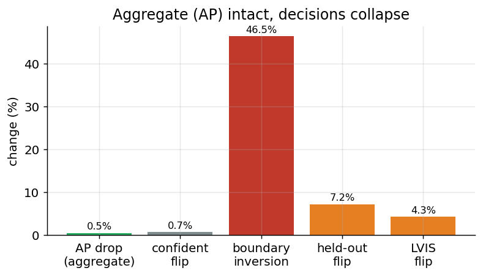
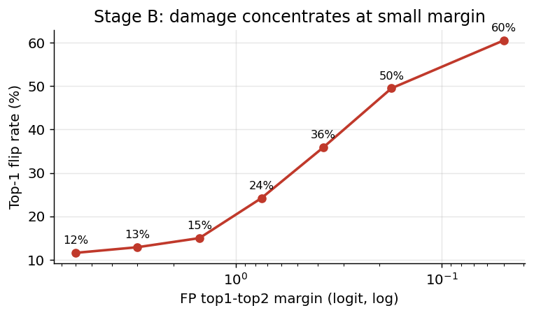
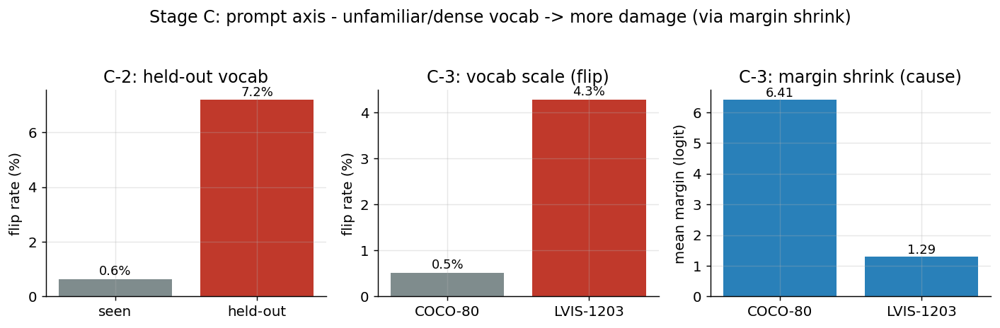

# PromptCal-PTQ — 전체 실험 마스터 요약

Open-vocabulary detector(YOLO-World)의 W8A8 양자화가 region–prompt 의미적
의사결정을 어떻게 손상시키는지 규명하고, 이를 보존하는 PTQ를 제안하기 위한 연구.

핵심 주장: **open-vocabulary 양자화는 tensor reconstruction 문제가 아니라
semantic decision preservation 문제다.**

---

## 0. 한눈에 보기 — 전체 로드맵

| 국면 | 내용 | 상태 |
|---|---|---|
| A. 발판 | FP32 baseline 재현 + SimilarityHarness 검증 | ✅ 완료 |
| B. 고정 프롬프트 손상 | naive W8A8이 경계 의사결정을 흔듦 | ✅ 완료 |
| C. 프롬프트 축 손상 | substitution / held-out / LVIS | ✅ 완료 |
| D. 강한 baseline | BRECQ/QDrop도 semantic 손상 못 막음 (예정) | ⏳ 착수 |
| E. 제안 방법 | Semantic Calibration + Utility Refinement | ⏳ 미착수 |

현재 위치: A·B·C(관찰/진단) 완료 → D(강한 baseline) 착수 지점.

---

## 1. 핵심 발견 (한 문장)

양자화는 총량 지표(AP)로는 거의 무해해 보이지만(-0.5), region–prompt 의사결정의
**경계(작은 margin)** 에서, **의미적으로 가까운 방향** 으로, 프롬프트가 **낯설거나
촘촘할수록** 심하게 손상된다. 이 손상은 AP·reconstruction으로는 관측되지 않는다.



---

## 2. 국면 A — 발판 (완료)

| 항목 | 결과 |
|---|---|
| FP32 baseline (COCO val, pycocotools) | mAP 37.8 (공식 37.7 재현) |
| size별 AP | small 21.5 / med 42.2 / large 50.1 |
| SimilarityHarness | cv4 캡처 [8400×P], 전역 argmax == 모델 예측 (검증) |

측정 도구(유사도 행렬 캡처)의 정확성이 검증되어, 이후 모든 손상 측정의 토대가 됨.

---

## 3. 국면 B — 고정 프롬프트 손상 (완료)

naive W8A8 (fuse 후, vision Conv, COCO 80 고정 프롬프트).

| 지표 | 값 | 의미 |
|---|---|---|
| AP 하락 | 37.8 → 37.3 (-0.5) | 총량은 멀쩡 |
| confident flip | 0.73% | 확실한 판정은 보존 |
| boundary inversion | 46.5% | 경계는 대규모 붕괴 |

**핵심 곡선 — 손상은 margin(경계)에 집중:**



margin<0.1에서 flip 60.5%, margin>8에서 0%. 이 margin–손상 법칙이 국면 C 전체의
메커니즘이 됨. (all-anchor flip 30%는 maxprob<0.05 배경 앵커의 노이즈로 판명.)

---

## 4. 국면 C — 프롬프트 축 손상 (완료)



| 실험 | 조건 | 핵심 결과 |
|---|---|---|
| C-1 substitution | COCO, flip 방향 분석 | flip의 69% 가 의미적 이웃으로 (우연의 10.9x) |
| C-2 held-out | 정답 프롬프트 제거 | flip 0.6% → 7.2% (margin 5.25→1.8) |
| C-3 LVIS | 80 → 1203 프롬프트 | flip 0.51% → 4.28%, margin 6.41→1.29, 편향 31x |

세 실험이 하나의 인과 사슬로 연결됨:

```
B:   margin 작을수록 flip 급증
C-1: 의미적 이웃 = 작은 margin → flip이 이웃으로 향함
C-2: 정답 제거 → margin 축소 → flip 악화
C-3: 촘촘한 vocab → margin 축소 → flip 증폭
```

margin 축소가 어디서 오든(정답 제거/vocab 확대) 손상이 그 뒤를 따름.

주의(지표 해석):
- 배수(held-out/seen, flip/chance)는 분모에 민감 → 절대값을 헤드라인으로.
- LVIS 이웃 비율은 k에 민감(top-5는 좁음, k=20에서 52%로 회복).

---

## 5. 국면 D — 강한 baseline (착수 지점)

**목적:** "reconstruction을 잘하는 강한 PTQ(BRECQ/QDrop)로도 semantic 손상은 안 없어진다"
를 입증 → 제안 방법의 필요성 확립.

**전략(잠정):** 방식 2 — 핵심 알고리즘을 우리 fake-quant 위에 재구현.
순서: AdaRound(learnable rounding) → BRECQ(block reconstruction) → QDrop(activation drop).
이유: 원 repo 이식(의존성 지옥) 회피 + harness/semantic 측정(04~07) 그대로 재사용.

**기대 결과표(채울 예정):**

| 방법 | AP | confident flip | held-out flip | LVIS flip |
|---|---|---|---|---|
| FP32 | 37.8 | 0 | - | - |
| Naive W8A8 | 37.3 | 0.7% | 7.2% | 4.3% |
| AdaRound | ? (↑ vs naive) | ? (여전히 높아야) | ? | ? |
| BRECQ/QDrop | ? | ? | ? | ? |
| **Ours** | 최고 | 최소 | 최소 | 최소 |

핵심 예측: 강한 baseline은 AP는 올리지만 semantic 지표(flip)는 못 낮춘다.

---

## 6. 국면 E — 제안 방법 (미착수)

Semantic Calibration(reliable region + competitive prompt로 보정) +
Utility-Constrained Refinement(scale/clip/round만 최적화, weight 고정).
목표: calibration vocabulary 과적합 억제, held-out에서도 의사결정 보존.

---

## 7. 실험 환경 / 코드베이스

- HW: L40S 46GB ×4, RTX 4000 Ada 20GB ×4 / CUDA 12.6 / torch cu126
- 모델: yolov8s-worldv2 (fused) / 데이터: COCO val2017, LVIS 1203 프롬프트
- 코드: 00_setup_coco ~ 07_lvis_compare, src/{harness, quant, metrics}
- 문서: PROGRESS_stage1-2 / PROGRESS_stage3(B) / PROGRESS_stageC / (본 문서)

---

## 8. 작업 규모 관점 (정직한 평가)

- 완료(A·B·C): 관찰/진단. 논문 Sec 3(Motivation)의 근거가 데이터로 확보됨.
- 남음(D·E): 성격이 다른 대형 작업.
  - D: 강한 baseline 재구현 — 알고리즘 이해 + 우리 프레임워크 통합. 중간 규모.
  - E: 제안 방법 설계·구현·튜닝. 최대 규모.
  - 추가: LVIS AP 측정, 최종 벤치마크표, ablation, efficiency(실제 INT8 배포).
- 전략적 판단: D와 E는 순서 유연(방법 먼저 → baseline 나중도 가능). 같은 표에서 비교됨.
