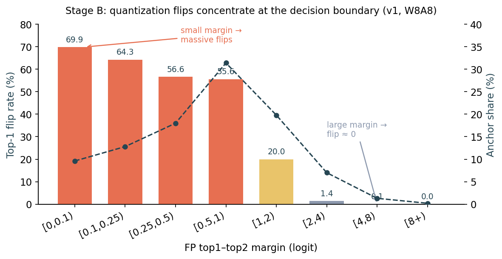
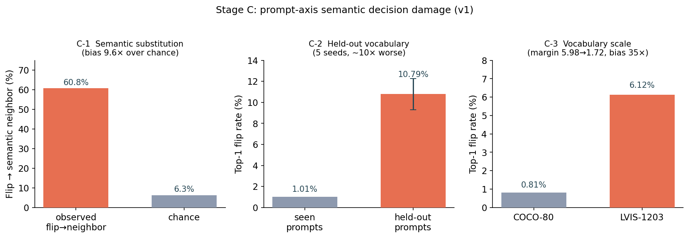

# PromptCal-PTQ — 국면 A·B·C 결과 정리 (yolov8s-world / v1)

모델: **yolov8s-world** (YOLO-World v1, small). W8A8 fake-quant.
데이터: COCO val2017. harness = WorldDetect.cv4(ContrastiveHead) 유사도 행렬 캡처.
평가: pycocotools. 모든 flip 지표는 FP32 예측을 기준(pseudo-GT)으로 한 결정 변화율.

---

## 국면 A — FP32 baseline 재현

| 지표 | 값 | 공식값 | 판정 |
|---|---|---|---|
| mAP@[.50:.95] | 37.4 | 37.4 | 정확 재현 ✅ |
| mAP50 | 52.0 | 52.0 | ✅ |
| mAP75 | 40.6 | 40.6 | ✅ |
| AP small / medium / large | 21.1 / 41.4 / 49.6 | — | — |

harness 검증: cv4 3개(ContrastiveHead), 유사도 행렬 [8400, 80], 전역 argmax == 모델 정식
예측 일치. → v1에서 측정 파이프라인 건강.

---

## 국면 B — 고정 프롬프트(COCO-80) 양자화 손상

naive W8A8. vision Conv 71개 래핑(cv4·DFL 제외). projection 제외(68개)해도 결과 동일.

### B-1. 양자화 AP

| | FP32 | W8A8 | 변화 |
|---|---|---|---|
| mAP@[.50:.95] | 37.4 | 33.9 | −3.5 |

v1은 양자화로 AP가 하락함. 단, 아래 (B-2)에서 보듯 이 하락은 **결정 경계에 집중**되며,
총량 지표(AP)가 담지 못하는 손상이 그 아래에 훨씬 크다.

### B-2. margin별 top-1 flip (핵심 — 경계 집중 손상)

FP top1–top2 margin(logit)이 작을수록(=경쟁이 팽팽할수록) flip이 급증하고,
margin이 크면 flip≈0으로 **단조 감소**. 손상이 semantic decision boundary에 집중됨을 정량화.

| margin 구간 | 앵커 비율 | top-1 flip |
|---|---|---|
| [0, 0.1) | 9.6% | **69.9%** |
| [0.1, 0.25) | 12.8% | 64.3% |
| [0.25, 0.5) | 18.0% | 56.6% |
| [0.5, 1.0) | 31.4% | 55.6% |
| [1.0, 2.0) | 19.8% | 20.0% |
| [2.0, 4.0) | 7.0% | 1.4% |
| [4.0, 8.0) | 1.3% | 0.1% |
| [8.0, ∞) | 0.2% | 0.0% |

보조(A: confidence 구간): maxprob<0.05 앵커가 전체의 98.6%를 차지하고 flip 47.2% —
이는 배경/저확신 앵커의 노이즈. 신뢰도 높은 구간일수록 flip은 0으로 감소.

---

## 국면 C — 프롬프트 축 의미적 손상 (핵심 기여)

양자화 flip이 무작위가 아니라 **의미적으로 가까운 프롬프트로 의사결정을 밀어냄**을 세 각도로 입증.
모두 AP와 독립적인 지표(프롬프트 축).

### C-1. Semantic substitution (COCO-80, 2000장, k=5)

| 지표 | 값 |
|---|---|
| confident regions | 98,238 |
| top-1 flip | 786 (0.8%) |
| flip → 의미적 이웃(top-5) | **60.8%** |
| 우연 기대치 | 6.3% |
| **편향 배수 (관측/우연)** | **9.6×** |

flip이 우연의 9.6배로 의미적 이웃에 쏠림 = 양자화가 semantic class substitution을 유발.

### C-2. Held-out vocabulary (5 seeds, 40/80 held-out, 2000장)

| seed | seen% | held-out% | 악화배수 |
|---|---|---|---|
| 0 | 1.21 | 9.63 | 8.0× |
| 1 | 1.39 | 10.75 | 7.7× |
| 2 | 1.16 | 10.73 | 9.2× |
| 3 | 0.59 | 13.55 | 23.0× |
| 4 | 0.68 | 9.32 | 13.8× |
| **mean** | **1.01** | **10.79** | **12.3×** |
| std | 0.32 | 1.49 | — |

held-out 프롬프트에서 flip이 seen 대비 ~10배 악화(mean margin seen 4.5 → held-out 1.4).
5개 seed 전부 동일 방향 → 분할 운이 아닌 견고한 현상. (seed 3·4의 큰 배수는 person이
held-out에 들어가 분모(seen)가 작아진 효과 — 절대값 10.79%를 헤드라인으로 해석.)

### C-3. Vocabulary scale: COCO-80 → LVIS-1203 (500장, k=20, 동일 이미지·앵커)

| vocab | top-1 flip | mean margin | small-margin 비율 | 이웃 편향 |
|---|---|---|---|---|
| COCO-80 | 0.81% | 5.98 | 2.1% | 3.4× |
| LVIS-1203 | **6.12%** | 1.72 | 20.2% | **35.0×** |

vocabulary가 촘촘해지면(80→1203) margin이 축소되고 경쟁이 심화 → flip 급증(0.81→6.12%),
이웃 편향 35×. OVOD 실제 규모에서 손상이 증폭됨을 입증.

---

## 종합

| 국면 | 관찰 | v1 결과 |
|---|---|---|
| A | baseline 재현 | mAP 37.4 정확 재현 ✅ |
| B | 경계 집중 손상 | margin<0.1에서 flip 69.9%, 단조 감소 ✅ |
| C-1 | semantic substitution | 편향 9.6× ✅ |
| C-2 | held-out 악화 | seen 1.01% → held-out 10.79% ✅ |
| C-3 | vocabulary scale | COCO 0.81% → LVIS 6.12%, 편향 35× ✅ |

**핵심:** 양자화는 region-prompt 의미적 의사결정을 (경계에서, 안 본 프롬프트에서, 촘촘한
vocabulary에서) 손상시키며, 그 손상은 무작위가 아니라 의미적 이웃으로 향한다. 이 프롬프트 축
손상이 논문의 본질적 기여이며, 총량 지표(AP)로는 온전히 드러나지 않는다.

## 실험 구성 메모
- 02(harness 검증)는 00b(v1 head 진단)로 대체. 03(naive flip 요약)은 03c(margin 곡선)로 커버.
- vision Conv 71개 래핑(cv4·DFL 제외). projection 제외해도 AP 동일(33.9) → projection은
  하락 주 원인 아님(v1 아키텍처 전반의 양자화 취약성).
- 다음: 국면 D(강한 baseline: AdaRound·QDrop·PD-Quant·BRECQ) v1 재현.
